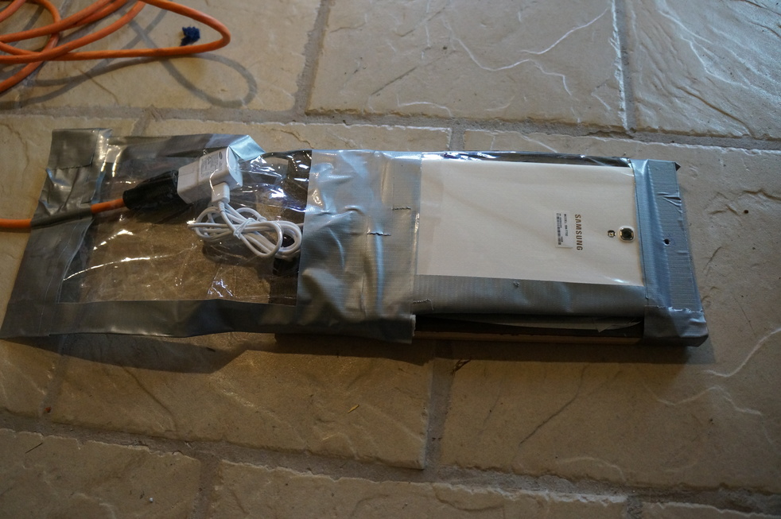
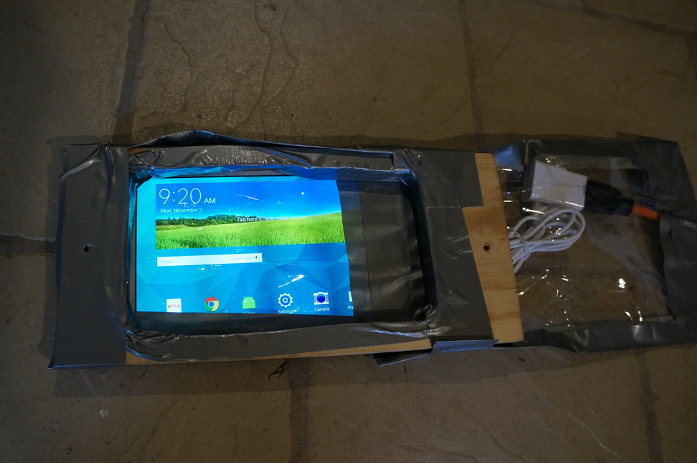
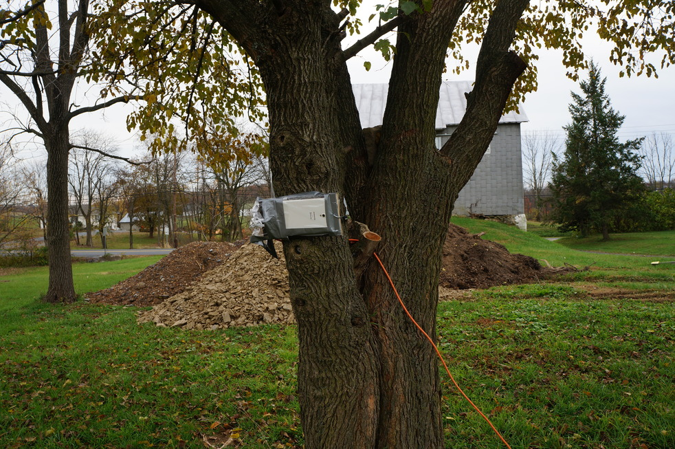
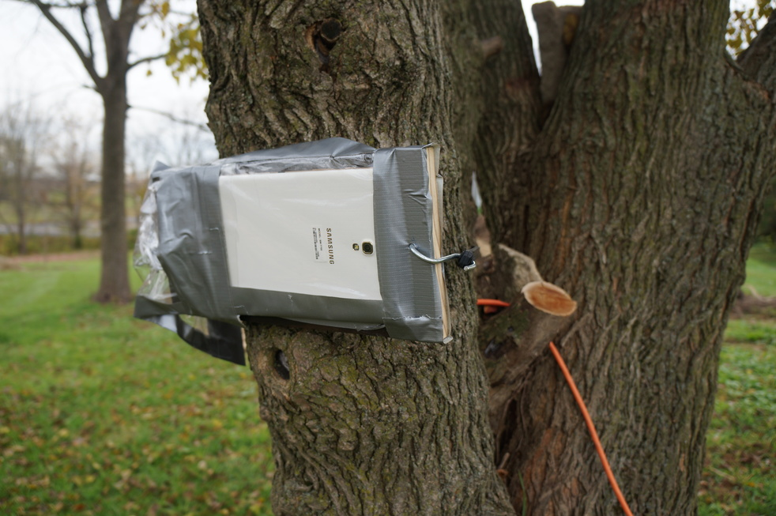
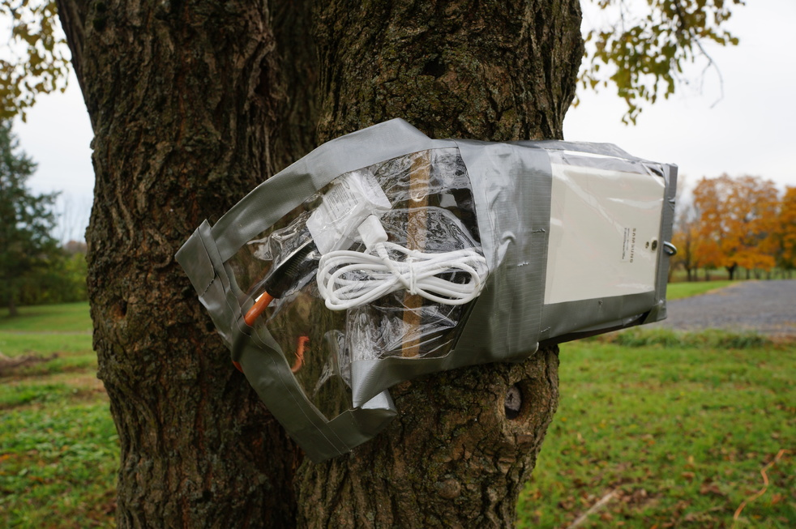

Lapse is a distributed remote controlled time lapse camera system. It consists of an android app (this repository) which can be installed on any number of devices. The devices connect via wifi (local network) to a controller application which serves as a place for the time lapse devices to offload photography, monitor/control/configure the lapse devices and view the photography that's been offloaded all through a web interface.

All of this stuff is still in very early developement so don't get excited if it doesn't work yet ;o)

Hack Mount
----------

Here are a few images of the hacked together mount I made for an off the shelf Galaxy Tab S 8.4in:

